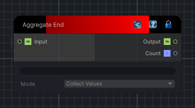

<link rel="stylesheet" href="../_assets/theme.css">

<button type="button" class="genesis-theme-toggle" data-genesis-theme-toggle aria-label="Toggle theme">Dark</button>

---
category: "Conditional"
---

# Aggregate End

> Closes a loop flow block and aggregates the loop-end input values across iterations.

## Description

Closes a loop flow block and aggregates the loop-end input values across iterations.

## Inputs

| Name | Type | Description |
|------|------|-------------|
| Input | Object |  |

## Outputs

| Name | Type |
|------|------|
| Count | Int32 |
| Output | Object |

## Parameters

| Setting | Type | Default | Description |
|---------|------|---------|-------------|
| mode | AggregateMode | CollectValues | |
| nodeVariables | VariableStorage | AhahGames.GenesisNoise.Graph.VariableStorage | |
| GUID | String | 43f14b42-5cda-462b-9b19-9ba8738111ec | |
| expanded | Boolean | False | |

## See Also

- [Back to Aggregate End](./conditional-index.md)
