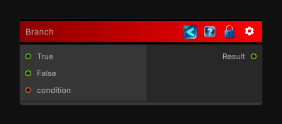

<link rel="stylesheet" href="../_assets/theme.css">

<button type="button" class="genesis-theme-toggle" data-genesis-theme-toggle aria-label="Toggle theme">Dark</button>

---
category: "Conditional"
---

# Branch

> Conditionally outputs either the true of false value depending on the condition value.

## Description

Conditionally outputs either the true of false value depending on the condition value.

## Inputs

| Name | Type | Description |
|------|------|-------------|

## Outputs

| Name | Type |
|------|------|

## Parameters

| Setting | Type | Default | Description |
|---------|------|---------|-------------|
| nodeVariables | VariableStorage | AhahGames.GenesisNoise.Graph.VariableStorage | |
| GUID | String | 5e2dff01-ca21-4933-ba0c-c69d9e8a370d | |
| expanded | Boolean | False | |

## See Also

- [Back to Branch](./conditional-index.md)
