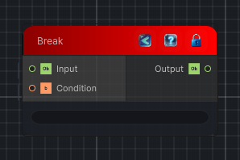

<link rel="stylesheet" href="../_assets/theme.css">

<button type="button" class="genesis-theme-toggle" data-genesis-theme-toggle aria-label="Toggle theme">Dark</button>

---
category: "Conditional"
---

# Break

> Passes the input through and requests an early exit from the current loop when the condition is true.

## Description

Passes the input through and requests an early exit from the current loop when the condition is true.

Place this node on the loop's main value path when you want its input to become the loop end value for the break iteration.

## Inputs

| Name | Type | Description |
|------|------|-------------|

## Outputs

| Name | Type |
|------|------|

## Parameters

| Setting | Type | Default | Description |
|---------|------|---------|-------------|
| nodeVariables | VariableStorage | AhahGames.GenesisNoise.Graph.VariableStorage | |
| GUID | String | 87353fd5-d041-4990-9bd7-3f6bf2808b91 | |
| expanded | Boolean | False | |

## See Also

- [Back to Break](./conditional-index.md)
