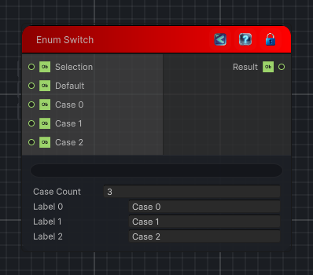

<link rel="stylesheet" href="../_assets/theme.css">

<button type="button" class="genesis-theme-toggle" data-genesis-theme-toggle aria-label="Toggle theme">Dark</button>

---
category: "Conditional"
---

# Enum Switch

> Selects one of several case inputs by using an integer selection value as a case index.

## Description

Selects one of several case inputs by using an integer selection value as a case index.

String selections are still matched against case labels for compatibility with older graphs.

## Inputs

| Name | Type | Description |
|------|------|-------------|

## Outputs

| Name | Type |
|------|------|

## Parameters

| Setting | Type | Default | Description |
|---------|------|---------|-------------|
| nodeVariables | VariableStorage | AhahGames.GenesisNoise.Graph.VariableStorage | |
| GUID | String | 301f2903-cb72-457a-af75-49f6e2f7f0df | |
| expanded | Boolean | False | |

## See Also

- [Back to Enum Switch](./conditional-index.md)
