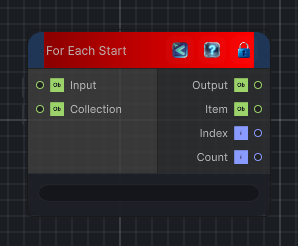

<link rel="stylesheet" href="../_assets/theme.css">

<button type="button" class="genesis-theme-toggle" data-genesis-theme-toggle aria-label="Toggle theme">Dark</button>

---
category: "Conditional"
---

# For Each Start

> Begins a for-each loop flow block over a collection input.

## Description

Begins a for-each loop flow block over a collection input.

The loop carries an input value between iterations while also exposing the current item, item index, and collection count.

## Inputs

| Name | Type | Description |
|------|------|-------------|
| Collection | Object |  |
| Input | Object |  |

## Outputs

| Name | Type |
|------|------|
| Count | Int32 |
| Index | Int32 |
| Item | Object |
| Output | Object |

## Parameters

| Setting | Type | Default | Description |
|---------|------|---------|-------------|
| nodeVariables | VariableStorage | AhahGames.GenesisNoise.Graph.VariableStorage | |
| GUID | String | 4d72a71c-2f3a-4a38-9746-81f9857822e3 | |
| expanded | Boolean | False | |

## See Also

- [Back to For Each Start](./conditional-index.md)
