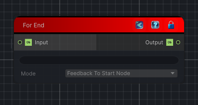

<link rel="stylesheet" href="../_assets/theme.css">

<button type="button" class="genesis-theme-toggle" data-genesis-theme-toggle aria-label="Toggle theme">Dark</button>

---
category: "Conditional"
---

# For End

> Closes a for-loop flow block.

## Description

Closes a for-loop flow block.

## Inputs

| Name | Type | Description |
|------|------|-------------|
| Input | Object |  |

## Outputs

| Name | Type |
|------|------|
| Output | Object |

## Parameters

| Setting | Type | Default | Description |
|---------|------|---------|-------------|
| mode | AggregationMode | FeedbackToStartNode | |
| nodeVariables | VariableStorage | AhahGames.GenesisNoise.Graph.VariableStorage | |
| GUID | String | 6fa46ed4-ef89-4a4d-8d8c-0b98d52fb0e4 | |
| expanded | Boolean | False | |

## See Also

- [Back to For End](./conditional-index.md)
