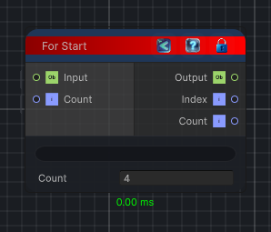

<link rel="stylesheet" href="../_assets/theme.css">

<button type="button" class="genesis-theme-toggle" data-genesis-theme-toggle aria-label="Toggle theme">Dark</button>

---
category: "Conditional"
---

# For Start

> Begins a for-loop flow block.

## Description

Begins a for-loop flow block.

## Inputs

| Name | Type | Description |
|------|------|-------------|
| Count | Int32 |  |
| Input | Object |  |

## Outputs

| Name | Type |
|------|------|
| Count | Int32 |
| Index | Int32 |
| Output | Object |

## Parameters

| Setting | Type | Default | Description |
|---------|------|---------|-------------|
| nodeVariables | VariableStorage | AhahGames.GenesisNoise.Graph.VariableStorage | |
| GUID | String | be707a76-ffaa-48c3-93a0-1a00ce9ace9e | |
| expanded | Boolean | False | |

## See Also

- [Back to For Start](./conditional-index.md)
