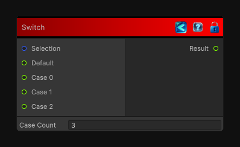

<link rel="stylesheet" href="../_assets/theme.css">

<button type="button" class="genesis-theme-toggle" data-genesis-theme-toggle aria-label="Toggle theme">Dark</button>

---
category: "Conditional"
---

# Switch

> Selects one of several case inputs using an integer selection index.

## Description

Selects one of several case inputs using an integer selection index.

If the selection is outside the available case range, the default input is returned instead.

## Inputs

| Name | Type | Description |
|------|------|-------------|

## Outputs

| Name | Type |
|------|------|

## Parameters

| Setting | Type | Default | Description |
|---------|------|---------|-------------|
| nodeVariables | VariableStorage | AhahGames.GenesisNoise.Graph.VariableStorage | |
| GUID | String | fe1c1b60-0673-4b81-9ccc-0a0a164ec460 | |
| expanded | Boolean | False | |

## See Also

- [Back to Switch](./conditional-index.md)
