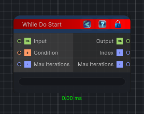

<link rel="stylesheet" href="../_assets/theme.css">

<button type="button" class="genesis-theme-toggle" data-genesis-theme-toggle aria-label="Toggle theme">Dark</button>

---
category: "Conditional"
---

# While Do Start

> Begins a while-do loop flow block.

## Description

Begins a while-do loop flow block.

The loop body always runs once, then continues while the condition input remains true and the max-iteration safety cap is not reached.

## Inputs

| Name | Type | Description |
|------|------|-------------|
| Max Iterations | Int32 |  |
| Condition | Boolean |  |
| Input | Object |  |

## Outputs

| Name | Type |
|------|------|
| Max Iterations | Int32 |
| Index | Int32 |
| Output | Object |

## Parameters

| Setting | Type | Default | Description |
|---------|------|---------|-------------|
| nodeVariables | VariableStorage | AhahGames.GenesisNoise.Graph.VariableStorage | |
| GUID | String | 792753a1-6cec-48a2-aa79-c9e7ab243275 | |
| expanded | Boolean | False | |

## See Also

- [Back to While Do Start](./conditional-index.md)
