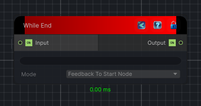

<link rel="stylesheet" href="../_assets/theme.css">

<button type="button" class="genesis-theme-toggle" data-genesis-theme-toggle aria-label="Toggle theme">Dark</button>

---
category: "Conditional"
---

# While End

> Closes a while-loop flow block.

## Description

Closes a while-loop flow block.

## Inputs

| Name | Type | Description |
|------|------|-------------|

## Outputs

| Name | Type |
|------|------|

## Parameters

| Setting | Type | Default | Description |
|---------|------|---------|-------------|
| mode | AggregationMode | FeedbackToStartNode | |
| nodeVariables | VariableStorage | AhahGames.GenesisNoise.Graph.VariableStorage | |
| GUID | String | 7377e08a-bd0d-45da-963e-115852620f9b | |
| expanded | Boolean | False | |

## See Also

- [Back to While End](./conditional-index.md)
