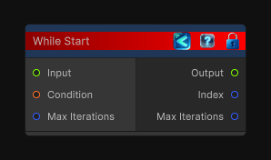

<link rel="stylesheet" href="../_assets/theme.css">

<button type="button" class="genesis-theme-toggle" data-genesis-theme-toggle aria-label="Toggle theme">Dark</button>

---
category: "Conditional"
---

# While Start

> Begins a while-loop flow block.

## Description

Begins a while-loop flow block.

The loop body only runs while the condition is already true before the first iteration, and it continues while the condition stays true and the max-iteration safety cap is not reached.

## Inputs

| Name | Type | Description |
|------|------|-------------|

## Outputs

| Name | Type |
|------|------|

## Parameters

| Setting | Type | Default | Description |
|---------|------|---------|-------------|
| nodeVariables | VariableStorage | AhahGames.GenesisNoise.Graph.VariableStorage | |
| GUID | String | 7ffb93f5-1c70-466a-8e23-49106378d61d | |
| expanded | Boolean | False | |

## See Also

- [Back to While Start](./conditional-index.md)
