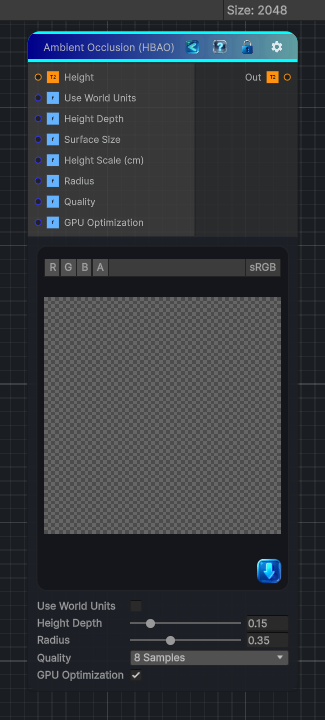

<link rel="stylesheet" href="../_assets/theme.css">

<button type="button" class="genesis-theme-toggle" data-genesis-theme-toggle aria-label="Toggle theme">Dark</button>

---
category: "Effects"
---

# Ambient Occlusion (HBAO)

> Generates ambient occlusion from a height map using a horizon-based method similar to Substance Designer's Ambient Occlusion (HBAO).

## Description

Generates ambient occlusion from a height map using a horizon-based method similar to Substance Designer's Ambient Occlusion (HBAO).

Use this when you want:
- Fast procedural AO from a height field
- Broad cavity and contact darkening
- A result similar to Substance's HBAO node

## Inputs

| Name | Type | Description |
|------|------|-------------|
| Height | Texture2D |  |
| Use World Units | Single |  |
| Height Depth | Single |  |
| Surface Size | Single |  |
| Height Scale (cm) | Single |  |
| Radius | Single |  |
| Quality | Single |  |
| GPU Optimization | Single |  |

## Outputs

| Name | Type |
|------|------|
| Out | Texture2D |

## Parameters

| Setting | Type | Default | Description |
|---------|------|---------|-------------|
| Use World Units | Toggle | 0 | Controls the use world units. |
| Height Depth | Range | 0.15 | Controls the height depth. |
| Surface Size | Range | 100.0 | Controls the surface size. |
| Height Scale (cm) | Range | 10.0 | Controls the height scale (cm). |
| Radius | Range | 0.35 | Controls the radius. |
| Quality | Enum | 1 | Controls the quality. |
| GPU Optimization | Toggle | 1 | Controls the gpu optimization. |

## See Also

- [Back to Ambient Occlusion (HBAO)](./effects-index.md)
