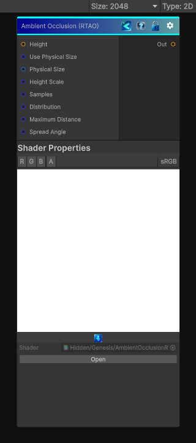

<link rel="stylesheet" href="../_assets/theme.css">

<button type="button" class="genesis-theme-toggle" data-genesis-theme-toggle aria-label="Toggle theme">Dark</button>

---
category: "Effects"
---

# Ambient Occlusion (RTAO)

> Generates ambient occlusion from a height map using a ray-traced approximation similar to Substance Designer's Ambient Occlusion (RTAO).

## Description

Generates ambient occlusion from a height map using a ray-traced approximation similar to Substance Designer's Ambient Occlusion (RTAO).

Compared to HBAO, this version is slower but produces smoother and more physically motivated shadowing.

## Inputs

| Name | Type | Description |
|------|------|-------------|
| Height | Texture2D |  |
| Use Physical Size | Single |  |
| Physical Size | Vector4 |  |
| Height Scale | Single |  |
| Samples | Single |  |
| Distribution | Single |  |
| Maximum Distance | Single |  |
| Spread Angle | Single |  |

## Outputs

| Name | Type |
|------|------|
| Out | Texture2D |

## Parameters

| Setting | Type | Default | Description |
|---------|------|---------|-------------|
| Use Physical Size | Toggle | 0 | Controls the use physical size. |
| Physical Size | Vector | (100, 100, 10, 0) | Controls the physical size. |
| Height Scale | Range | 2.0 | Controls the height scale. |
| Samples | Int Range | 24 | Controls the samples. |
| Distribution | Enum | 1 | Controls the distribution. |
| Maximum Distance | Range | 0.35 | Controls the maximum distance. |
| Spread Angle | Range | 1.0 | Controls the spread angle. |

## See Also

- [Back to Ambient Occlusion (RTAO)](./effects-index.md)
