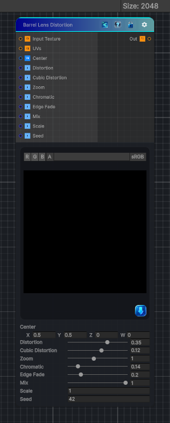

<link rel="stylesheet" href="../_assets/theme.css">

<button type="button" class="genesis-theme-toggle" data-genesis-theme-toggle aria-label="Toggle theme">Dark</button>

---
category: "Effects"
---

# Barrel Lens Distortion

> Barrel Lens Distortion Effect

## Description

Barrel Lens Distortion Effect

Applies radial barrel or pincushion lens distortion to an input texture, with zoom compensation, chromatic fringing, edge fade, and mix controls.

## Inputs

| Name | Type | Description |
|------|------|-------------|
| Input Texture | Texture2D |  |
| UVs | Texture2D |  |
| Center | Vector4 | Center of the lens |
| Distortion | Single | Barrel distortion amount, negative values create pincushion distortion |
| Cubic Distortion | Single | Higher order distortion for stronger edge bend |
| Zoom | Single | Zoom compensation after distortion |
| Chromatic | Single | Chromatic channel separation |
| Edge Fade | Single | Edge fade for stretched borders |
| Mix | Single | Blend between original and distorted image |
| Scale | Single | Input UV scale |
| Seed | Single | Random seed |

## Outputs

| Name | Type |
|------|------|
| Out | Texture2D |

## Parameters

| Setting | Type | Default | Description |
|---------|------|---------|-------------|
| Center | Vector | (0.5,0.5,0,0) | Center of the lens |
| Distortion | Range | 0.35 | Barrel distortion amount, negative values create pincushion distortion |
| Cubic Distortion | Range | 0.12 | Higher order distortion for stronger edge bend |
| Zoom | Range | 1.0 | Zoom compensation after distortion |
| Chromatic | Range | 0.14 | Chromatic channel separation |
| Edge Fade | Range | 0.2 | Edge fade for stretched borders |
| Mix | Range | 1.0 | Blend between original and distorted image |
| Scale | Float | 1.0 | Input UV scale |
| Seed | Int | 42 | Random seed |

## See Also

- [Back to Barrel Lens Distortion](./effects-index.md)
