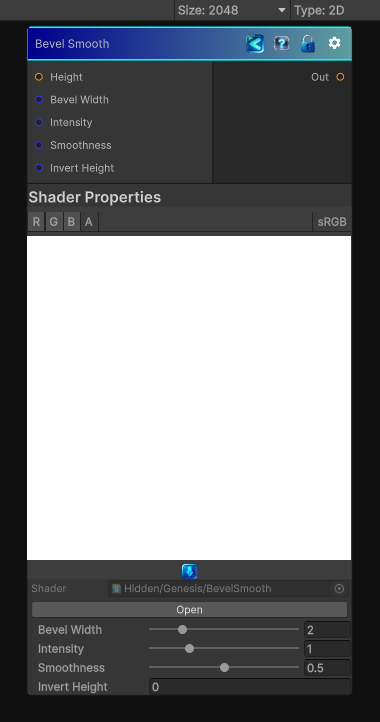

<link rel="stylesheet" href="../_assets/theme.css">

<button type="button" class="genesis-theme-toggle" data-genesis-theme-toggle aria-label="Toggle theme">Dark</button>

---
category: "Effects"
---

# Bevel Smooth

> • 	A height‑to‑normal conversion

## Description

• 	A height‑to‑normal conversion
• 	Followed by normal integration
• 	Followed by lighting‑style shading (usually lambertian or half‑lambert)
• 	With optional width, smoothness, and profile shaping
• 	Softer slopes
• 	No harsh transitions

## Inputs

| Name | Type | Description |
|------|------|-------------|

## Outputs

| Name | Type |
|------|------|

## Parameters

| Setting | Type | Default | Description |
|---------|------|---------|-------------|
| Bevel Width | Range | 2 | Controls the bevel width. |
| Intensity | Range | 1 | Controls the intensity. |
| Smoothness | Range | 0.5 | Controls the smoothness. |
| Invert Height | Int | 0 | Controls the invert height. |

## See Also

- [Back to Bevel Smooth](./effects-index.md)
