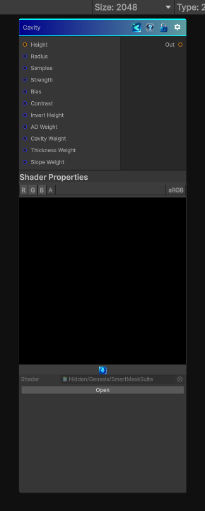

<link rel="stylesheet" href="../_assets/theme.css">

<button type="button" class="genesis-theme-toggle" data-genesis-theme-toggle aria-label="Toggle theme">Dark</button>

---
category: "Effects"
---

# Cavity

> Extracts concave cavity information from a height field.

## Description

Extracts concave cavity information from a height field.

This is useful for:
- Dust and grime buildup masks
- Crack enhancement
- Fine material breakup

## Inputs

| Name | Type | Description |
|------|------|-------------|

## Outputs

| Name | Type |
|------|------|

## Parameters

| Setting | Type | Default | Description |
|---------|------|---------|-------------|
| Radius | Range | 16 | Controls the radius. |
| Samples | Range | 16 | Controls the samples. |
| Strength | Range | 1 | Controls the strength. |
| Bias | Range | 0.02 | Controls the bias. |
| Contrast | Range | 1 | Controls the contrast. |
| Invert Height | Int | 0 | Controls the invert height. |
| AO Weight | Range | 1 | Controls the ao weight. |
| Cavity Weight | Range | 1 | Controls the cavity weight. |
| Thickness Weight | Range | 1 | Controls the thickness weight. |
| Slope Weight | Range | 0.5 | Controls the slope weight. |
| Mode | Float | 0 | Controls the mode. |

## See Also

- [Back to Cavity](./effects-index.md)
