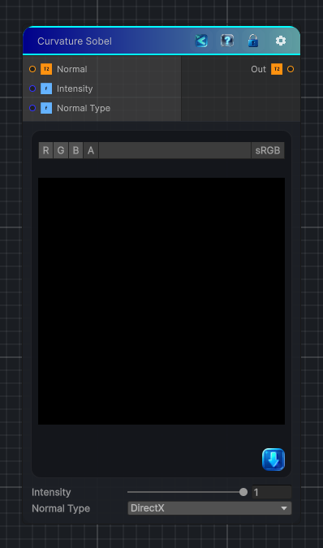

<link rel="stylesheet" href="../_assets/theme.css">

<button type="button" class="genesis-theme-toggle" data-genesis-theme-toggle aria-label="Toggle theme">Dark</button>

---
category: "Effects"
---

# Curvature Sobel

> Performs a sharp, single-pass Sobel curvature conversion from a tangent-space normal map. Convex areas are bright, concave areas are dark, and flat areas are 50% gray.

## Description

Performs a sharp, single-pass Sobel curvature conversion from a tangent-space normal map. Convex areas are bright, concave areas are dark, and flat areas are 50% gray.

## Inputs

| Name | Type | Description |
|------|------|-------------|
| Normal | Texture2D |  |
| Intensity | Single |  |
| Normal Type | Single |  |

## Outputs

| Name | Type |
|------|------|
| Out | Texture2D |

## Parameters

| Setting | Type | Default | Description |
|---------|------|---------|-------------|
| Intensity | Range | 1 | Controls the intensity. |
| Normal Type | Enum | 0 | Controls the normal type. |

## See Also

- [Back to Curvature Sobel](./effects-index.md)
