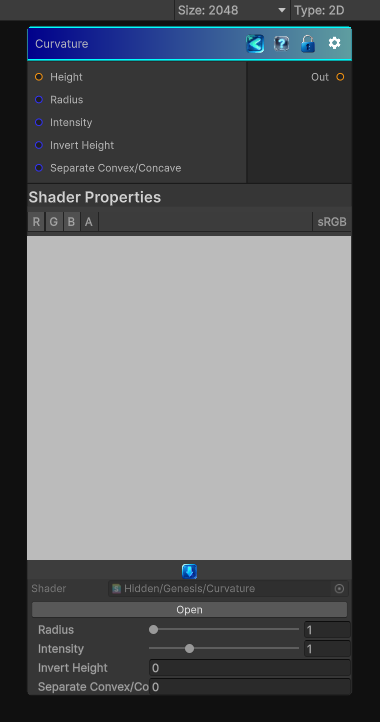

<link rel="stylesheet" href="../_assets/theme.css">

<button type="button" class="genesis-theme-toggle" data-genesis-theme-toggle aria-label="Toggle theme">Dark</button>

---
category: "Effects"
---

# Curvature

> Simulates Substance’s Curvature node from a height map: convex/concave detection via a Laplacian‑style kernel, remapped to 0–1, with optional separate convex/concave outputs.

## Description

Simulates Substance’s Curvature node from a height map: convex/concave detection via a Laplacian‑style kernel, remapped to 0–1, with optional separate convex/concave outputs.

## Inputs

| Name | Type | Description |
|------|------|-------------|
| Height | Texture2D |  |
| Radius | Single |  |
| Intensity | Single |  |
| Invert Height | Single |  |
| Separate Convex/Concave | Single |  |

## Outputs

| Name | Type |
|------|------|
| Out | Texture2D |

## Parameters

| Setting | Type | Default | Description |
|---------|------|---------|-------------|
| Radius | Range | 1 | Controls the radius. |
| Intensity | Range | 1 | Controls the intensity. |
| Invert Height | Int | 0 | Controls the invert height. |
| Separate Convex/Concave | Int | 0 | Controls the separate convex/concave. |

## See Also

- [Back to Curvature](./effects-index.md)
