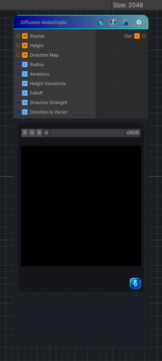

<link rel="stylesheet" href="../_assets/theme.css">

<button type="button" class="genesis-theme-toggle" data-genesis-theme-toggle aria-label="Toggle theme">Dark</button>

---
category: "Effects"
---

# Diffusion Anisotropic

> A multi‑iteration direction influenced

## Description

A multi‑iteration direction influenced
• 	With edge‑preserving falloff
• 	Driven by height differences
• 	Producing a soft, organic spreading effect (like watercolor diffusion or clay smearing)

## Inputs

| Name | Type | Description |
|------|------|-------------|
| Source | Texture2D |  |
| Height | Texture2D |  |
| Direction Map | Texture2D |  |
| Radius | Single |  |
| Iterations | Single |  |
| Height Sensitivity | Single |  |
| Falloff | Single |  |
| Direction Strength | Single |  |
| Direction Is Vector | Single |  |

## Outputs

| Name | Type |
|------|------|
| Out | Texture2D |

## Parameters

| Setting | Type | Default | Description |
|---------|------|---------|-------------|
| Radius | Range | 3 | Controls the radius. |
| Iterations | Range | 4 | Controls the iterations. |
| Height Sensitivity | Range | 1 | Controls the height sensitivity. |
| Falloff | Range | 0.5 | Controls the falloff. |
| Direction Strength | Range | 1 | Controls the direction strength. |
| Direction Is Vector | Int | 0 | Controls the direction is vector. |

## See Also

- [Back to Diffusion Anisotropic](./effects-index.md)
