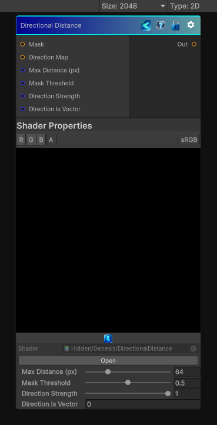

<link rel="stylesheet" href="../_assets/theme.css">

<button type="button" class="genesis-theme-toggle" data-genesis-theme-toggle aria-label="Toggle theme">Dark</button>

---
category: "Effects"
---

# Directional Distance

> It computes distance to a feature (usually black/white mask) along a specified direction, not radially.

## Description

It computes distance to a feature (usually black/white mask) along a specified direction, not radially.

- ✔ Direction map (angle or vector)
- ✔ Distance accumulation along direction
- ✔ Adjustable max distance
- ✔ Height/mask thresholding
- ✔ Works for 2D / 3D / Cube
- ✔ Deterministic, no loops dependent on texture size

## Inputs

| Name | Type | Description |
|------|------|-------------|

## Outputs

| Name | Type |
|------|------|

## Parameters

| Setting | Type | Default | Description |
|---------|------|---------|-------------|
| Max Distance (px) | Range | 64 | Controls the max distance (px). |
| Mask Threshold | Range | 0.5 | Controls the mask threshold. |
| Direction Strength | Range | 1 | Controls the direction strength. |
| Direction Is Vector | Int | 0 | Controls the direction is vector. |

## See Also

- [Back to Directional Distance](./effects-index.md)
