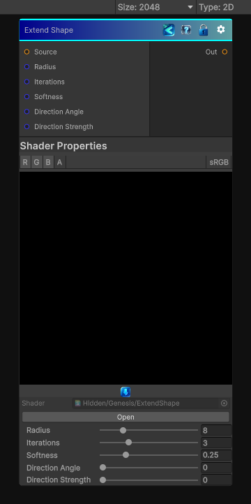

<link rel="stylesheet" href="../_assets/theme.css">

<button type="button" class="genesis-theme-toggle" data-genesis-theme-toggle aria-label="Toggle theme">Dark</button>

---
category: "Effects"
---

# Extend Shape

> - ✔ True morphological dilation

## Description

- ✔ True morphological dilation
- ✔ Radius‑based expansion
- ✔ Soft falloff (“Smooth” mode)
- ✔ Iterative growth
- ✔ Optional directional bias (like Extend Shape Directional)
- ✔ Works for 2D / 3D / Cube

## Inputs

| Name | Type | Description |
|------|------|-------------|
| Source | Texture2D |  |
| Radius | Single |  |
| Iterations | Single |  |
| Softness | Single |  |
| Direction Angle | Single |  |
| Direction Strength | Single |  |

## Outputs

| Name | Type |
|------|------|
| Out | Texture2D |

## Parameters

| Setting | Type | Default | Description |
|---------|------|---------|-------------|
| Radius | Range | 8 | Controls the radius. |
| Iterations | Range | 3 | Controls the iterations. |
| Softness | Range | 0.25 | Controls the softness. |
| Direction Angle | Range | 0 | Controls the direction angle. |
| Direction Strength | Range | 0 | Controls the direction strength. |

## See Also

- [Back to Extend Shape](./effects-index.md)
