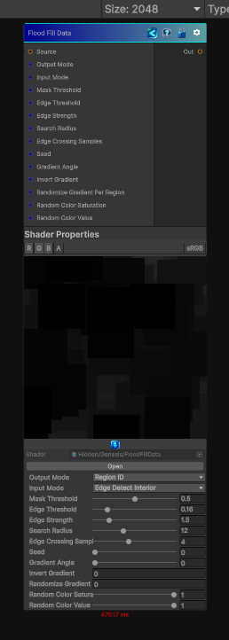

<link rel="stylesheet" href="../_assets/theme.css">

<button type="button" class="genesis-theme-toggle" data-genesis-theme-toggle aria-label="Toggle theme">Dark</button>

---
category: "Effects"
---

# Flood Fill Data

> Substance-style Flood Fill Data node.

## Description

Substance-style Flood Fill Data node.

Edge-detects the source image/mask, treats detected edges as borders, and converts the enclosed interiors into deterministic per-region data usable by Flood Fill companion filters:
- Region ID
- Position inside estimated region bounds
- Bounding-box size
- Random color
- Per-region gradient

By default the input is edge-detected and non-edge interiors are filled. Switch Input Mode to Mask Interior for legacy white-region/black-background behavior.

## Inputs

| Name | Type | Description |
|------|------|-------------|

## Outputs

| Name | Type |
|------|------|

## Parameters

| Setting | Type | Default | Description |
|---------|------|---------|-------------|
| Output Mode | Enum | 0 | Controls the output mode. |
| Input Mode | Enum | 1 | Controls the input mode. |
| Mask Threshold | Range | 0.5 | Controls the mask threshold. |
| Edge Threshold | Range | 0.16 | Controls the edge threshold. |
| Edge Strength | Range | 1.5 | Controls the edge strength. |
| Search Radius | Range | 12 | Controls the search radius. |
| Edge Crossing Samples | Range | 4 | Controls the edge crossing samples. |
| Seed | Range | 0 | Controls the seed. |
| Gradient Angle | Range | 0 | Controls the gradient angle. |
| Invert Gradient | Int | 0 | Controls the invert gradient. |
| Randomize Gradient Per Region | Int | 0 | Controls the randomize gradient per region. |
| Random Color Saturation | Range | 1 | Controls the random color saturation. |
| Random Color Value | Range | 1 | Controls the random color value. |

## See Also

- [Back to Flood Fill Data](./effects-index.md)
