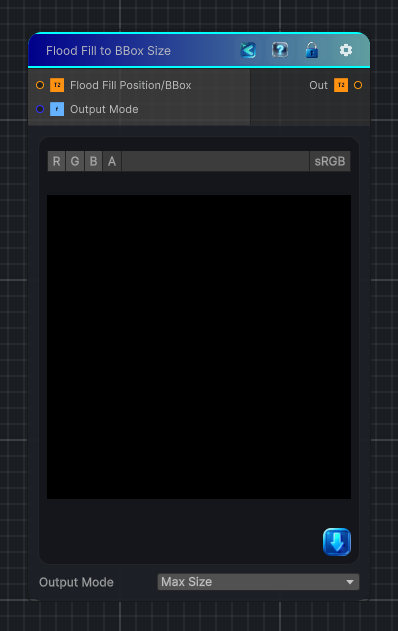

<link rel="stylesheet" href="../_assets/theme.css">

<button type="button" class="genesis-theme-toggle" data-genesis-theme-toggle aria-label="Toggle theme">Dark</button>

---
category: "Effects"
---

# Flood Fill to BBox Size

> Extracts per-region bounding-box size data from Flood Fill Data output mode Position/BBox.

## Description

Extracts per-region bounding-box size data from Flood Fill Data output mode Position/BBox.

## Inputs

| Name | Type | Description |
|------|------|-------------|
| Flood Fill Position/BBox | Texture2D |  |
| Output Mode | Single |  |

## Outputs

| Name | Type |
|------|------|
| Out | Texture2D |

## Parameters

| Setting | Type | Default | Description |
|---------|------|---------|-------------|
| Output Mode | Enum | 0 | Controls the output mode. |

## See Also

- [Back to Flood Fill to BBox Size](./effects-index.md)
