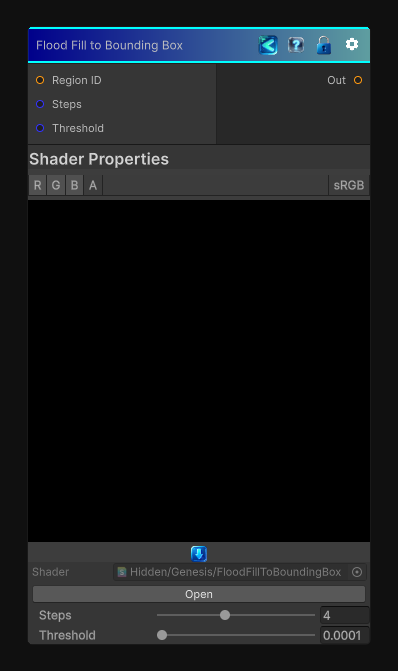

<link rel="stylesheet" href="../_assets/theme.css">

<button type="button" class="genesis-theme-toggle" data-genesis-theme-toggle aria-label="Toggle theme">Dark</button>

---
category: "Effects"
---

# Flood Fill to Bounding Box

> Flood Fill to Bounding Box does three things:

## Description

Flood Fill to Bounding Box does three things:
- Finds the min/max UV extents of each region
- Normalizes the pixel’s position inside that bounding box
- Outputs a 0–1 coordinate inside the region’s box
- R = normalized X
- G = normalized Y
- B = region size (optional)
To do this in a single‑pass CRT shader, we use a hash‑based pseudo‑bounding‑box estimator that is stable and deterministic

## Inputs

| Name | Type | Description |
|------|------|-------------|

## Outputs

| Name | Type |
|------|------|

## Parameters

| Setting | Type | Default | Description |
|---------|------|---------|-------------|
| Steps | Range | 4 | Controls the steps. |
| Threshold | Range | 0.0001 | Controls the threshold. |

## See Also

- [Back to Flood Fill to Bounding Box](./effects-index.md)
