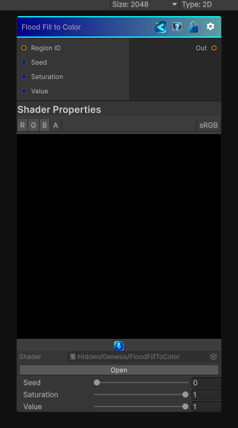

<link rel="stylesheet" href="../_assets/theme.css">

<button type="button" class="genesis-theme-toggle" data-genesis-theme-toggle aria-label="Toggle theme">Dark</button>

---
category: "Effects"
---

# Flood Fill to Color

> - One unique color per region

## Description

- One unique color per region
- Colors are stable (seeded by region ID)
- Fully deterministic
- Works for any number of regions
- Perfect for debugging segmentation or stylized region masks

## Inputs

| Name | Type | Description |
|------|------|-------------|

## Outputs

| Name | Type |
|------|------|

## Parameters

| Setting | Type | Default | Description |
|---------|------|---------|-------------|
| Seed | Range | 0 | Controls the seed. |
| Saturation | Range | 1 | Controls the saturation. |
| Value | Range | 1 | Controls the value. |

## See Also

- [Back to Flood Fill to Color](./effects-index.md)
