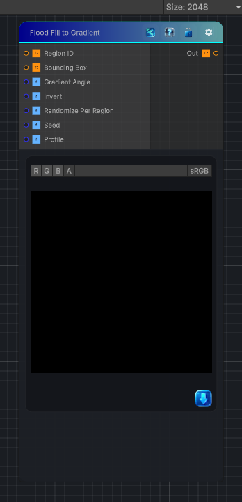

<link rel="stylesheet" href="../_assets/theme.css">

<button type="button" class="genesis-theme-toggle" data-genesis-theme-toggle aria-label="Toggle theme">Dark</button>

---
category: "Effects"
---

# Flood Fill to Gradient

> This node takes the Region ID map and the Bounding Box map and produces a per‑region gradient, exactly like Substance:

## Description

This node takes the Region ID map and the Bounding Box map and produces a per‑region gradient, exactly like Substance:
- ✔ Gradient runs inside each region, not globally
- ✔ Uses the region’s bounding box to normalize coordinates
- ✔ Supports direction angle, invert, profile, random per‑region rotation
- ✔ Fully deterministic
- ✔ Fully Genesis CRT–compliant (2D / 3D / Cube, SAMPLE_X, GenesisFragment)

## Inputs

| Name | Type | Description |
|------|------|-------------|
| Region ID | Texture2D |  |
| Bounding Box | Texture2D |  |
| Gradient Angle | Single |  |
| Invert | Single |  |
| Randomize Per Region | Single |  |
| Seed | Single |  |
| Profile | Single |  |

## Outputs

| Name | Type |
|------|------|
| Out | Texture2D |

## Parameters

| Setting | Type | Default | Description |
|---------|------|---------|-------------|
| Gradient Angle | Range | 0 | Controls the gradient angle. |
| Invert | Int | 0 | Controls the invert. |
| Randomize Per Region | Int | 0 | Controls the randomize per region. |
| Seed | Range | 0 | Controls the seed. |
| Profile | Range | 0.5 | Controls the profile. |

## See Also

- [Back to Flood Fill to Gradient](./effects-index.md)
