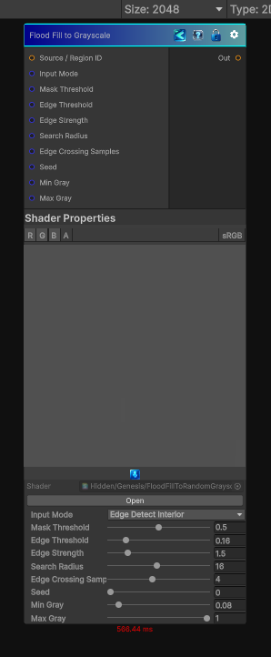

<link rel="stylesheet" href="../_assets/theme.css">

<button type="button" class="genesis-theme-toggle" data-genesis-theme-toggle aria-label="Toggle theme">Dark</button>

---
category: "Effects"
---

# Flood Fill to Grayscale

> - Edge-detects boxed input by default and fills each interior box with one stable random grayscale value

## Description

- Edge-detects boxed input by default and fills each interior box with one stable random grayscale value
- Can also consume an existing Region ID map
- All pixels in the same estimated box share the same value
- Randomness is stable and seeded

## Inputs

| Name | Type | Description |
|------|------|-------------|

## Outputs

| Name | Type |
|------|------|

## Parameters

| Setting | Type | Default | Description |
|---------|------|---------|-------------|
| Input Mode | Enum | 1 | Controls the input mode. |
| Mask Threshold | Range | 0.5 | Controls the mask threshold. |
| Edge Threshold | Range | 0.16 | Controls the edge threshold. |
| Edge Strength | Range | 1.5 | Controls the edge strength. |
| Search Radius | Range | 16 | Controls the search radius. |
| Edge Crossing Samples | Range | 4 | Controls the edge crossing samples. |
| Seed | Range | 0 | Controls the seed. |
| Min Gray | Range | 0.08 | Controls the min gray. |
| Max Gray | Range | 1.0 | Controls the max gray. |

## See Also

- [Back to Flood Fill to Grayscale](./effects-index.md)
