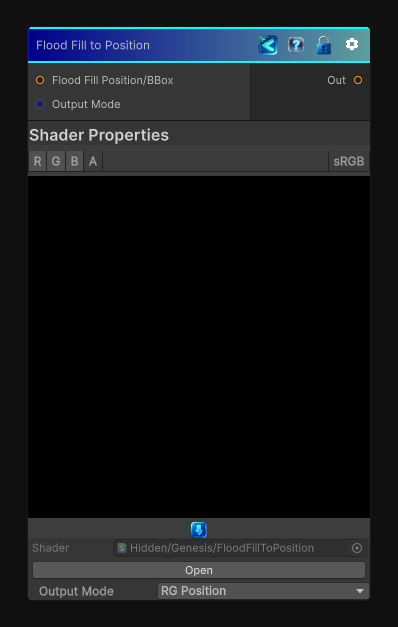

<link rel="stylesheet" href="../_assets/theme.css">

<button type="button" class="genesis-theme-toggle" data-genesis-theme-toggle aria-label="Toggle theme">Dark</button>

---
category: "Effects"
---

# Flood Fill to Position

> Extracts normalized per-region position data from Flood Fill Data output mode Position or Flood Fill to Bounding Box.

## Description

Extracts normalized per-region position data from Flood Fill Data output mode Position or Flood Fill to Bounding Box.

## Inputs

| Name | Type | Description |
|------|------|-------------|

## Outputs

| Name | Type |
|------|------|

## Parameters

| Setting | Type | Default | Description |
|---------|------|---------|-------------|
| Output Mode | Enum | 0 | Controls the output mode. |

## See Also

- [Back to Flood Fill to Position](./effects-index.md)
