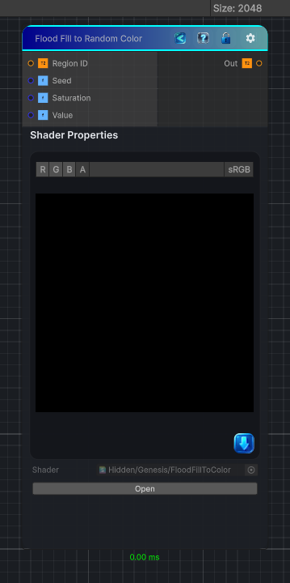

<link rel="stylesheet" href="../_assets/theme.css">

<button type="button" class="genesis-theme-toggle" data-genesis-theme-toggle aria-label="Toggle theme">Dark</button>

---
category: "Effects"
---

# Flood Fill to Random Color

> Substance-style Flood Fill to Random Color.

## Description

Substance-style Flood Fill to Random Color.

Assigns each flood-filled region a stable seeded random color. This is an alias of the existing Flood Fill to Color behavior using Substance naming.

## Inputs

| Name | Type | Description |
|------|------|-------------|
| Region ID | Texture2D |  |
| Seed | Single |  |
| Saturation | Single |  |
| Value | Single |  |

## Outputs

| Name | Type |
|------|------|
| Out | Texture2D |

## Parameters

| Setting | Type | Default | Description |
|---------|------|---------|-------------|
| Seed | Range | 0 | Controls the seed. |
| Saturation | Range | 1 | Controls the saturation. |
| Value | Range | 1 | Controls the value. |

## See Also

- [Back to Flood Fill to Random Color](./effects-index.md)
