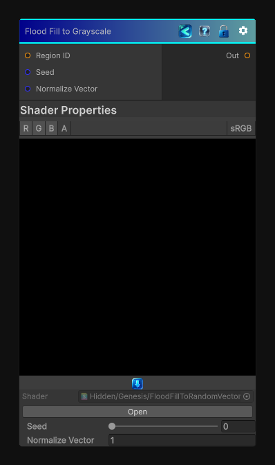

<link rel="stylesheet" href="../_assets/theme.css">

<button type="button" class="genesis-theme-toggle" data-genesis-theme-toggle aria-label="Toggle theme">Dark</button>

---
category: "Effects"
---

# Flood Fill to Random Vector

> This node is the vector‑based sibling of:

## Description

This node is the vector‑based sibling of:
• 	Flood Fill to Random Grayscale
• 	Flood Fill to Color
But instead of grayscale or color, each region gets a stable random 2D vector — perfect for:
• 	Anisotropic effects
• 	Direction‑aware noise
• 	Flow‑aligned stylization
• 	Region‑based vector fields
• 	Procedural fiber/grain direction

## Inputs

| Name | Type | Description |
|------|------|-------------|
| Region ID | Texture2D |  |
| Seed | Single |  |
| Normalize Vector | Single |  |

## Outputs

| Name | Type |
|------|------|
| Out | Texture2D |

## Parameters

| Setting | Type | Default | Description |
|---------|------|---------|-------------|
| Seed | Range | 0 | Controls the seed. |
| Normalize Vector | Int | 1 | Controls the normalize vector. |

## See Also

- [Back to Flood Fill to Random Vector](./effects-index.md)
