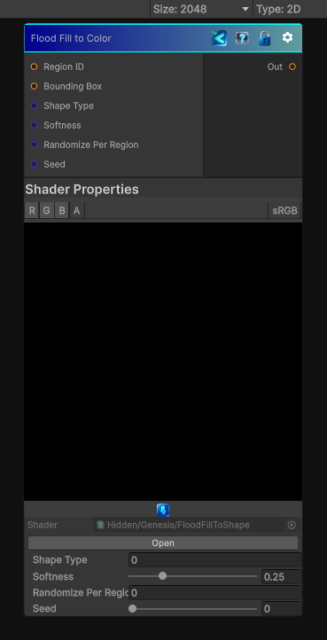

<link rel="stylesheet" href="../_assets/theme.css">

<button type="button" class="genesis-theme-toggle" data-genesis-theme-toggle aria-label="Toggle theme">Dark</button>

---
category: "Effects"
---

# Flood Fill To Shape

> In Genesis, this is used for:

## Description

In Genesis, this is used for:
- Stylized shape masks
- Region‑aware patterning
- Procedural tile shapes
- Shape‑driven gradients
- Region‑based stylization
To replicate this in Genesis CRT, we combine:
- Region ID
- Bounding Box (normalized UV inside region)
- A shape function (circle, diamond, square, etc.)
- Optional per‑region randomization

## Inputs

| Name | Type | Description |
|------|------|-------------|

## Outputs

| Name | Type |
|------|------|

## Parameters

| Setting | Type | Default | Description |
|---------|------|---------|-------------|
| Shape Type | Int | 0   // 0=Circle, 1=Diamond, 2=Square | Controls the shape type. |
| Softness | Range | 0.25 | Controls the softness. |
| Randomize Per Region | Int | 0 | Controls the randomize per region. |
| Seed | Range | 0 | Controls the seed. |

## See Also

- [Back to Flood Fill To Shape](./effects-index.md)
