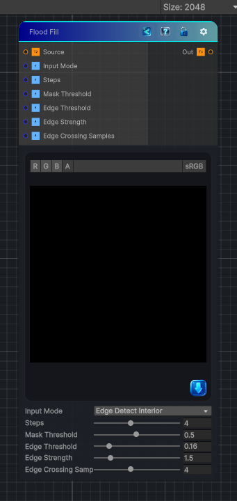

<link rel="stylesheet" href="../_assets/theme.css">

<button type="button" class="genesis-theme-toggle" data-genesis-theme-toggle aria-label="Toggle theme">Dark</button>

---
category: "Effects"
---

# Flood Fill

> Edge-detects the input, treats detected edges as borders, and produces a stable region ID map for the interiors. Switch Input Mode to Mask Interior for legacy white-region/black-background behavior.

## Description

Edge-detects the input, treats detected edges as borders, and produces a stable region ID map for the interiors. Switch Input Mode to Mask Interior for legacy white-region/black-background behavior.

## Inputs

| Name | Type | Description |
|------|------|-------------|
| Source | Texture2D |  |
| Input Mode | Single |  |
| Steps | Single |  |
| Mask Threshold | Single |  |
| Edge Threshold | Single |  |
| Edge Strength | Single |  |
| Edge Crossing Samples | Single |  |

## Outputs

| Name | Type |
|------|------|
| Out | Texture2D |

## Parameters

| Setting | Type | Default | Description |
|---------|------|---------|-------------|
| Input Mode | Enum | 1 | Controls the input mode. |
| Steps | Range | 4 | Controls the steps. |
| Mask Threshold | Range | 0.5 | Controls the mask threshold. |
| Edge Threshold | Range | 0.16 | Controls the edge threshold. |
| Edge Strength | Range | 1.5 | Controls the edge strength. |
| Edge Crossing Samples | Range | 4 | Controls the edge crossing samples. |

## See Also

- [Back to Flood Fill](./effects-index.md)
