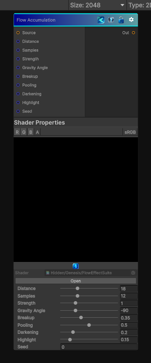

<link rel="stylesheet" href="../_assets/theme.css">

<button type="button" class="genesis-theme-toggle" data-genesis-theme-toggle aria-label="Toggle theme">Dark</button>

---
category: "Effects"
---

# Flow Accumulation

> Builds a grayscale flow and pooling mask from the source texture's luminance.

## Description

Builds a grayscale flow and pooling mask from the source texture's luminance.

Use this when you want:
- Runoff accumulation masks
- Puddle and stain drivers
- Inputs for later wetness or wear effects

## Inputs

| Name | Type | Description |
|------|------|-------------|

## Outputs

| Name | Type |
|------|------|

## Parameters

| Setting | Type | Default | Description |
|---------|------|---------|-------------|
| Distance | Range | 18 | Controls the distance. |
| Samples | Range | 12 | Controls the samples. |
| Strength | Range | 1 | Controls the strength. |
| Gravity Angle | Range | -90 | Controls the gravity angle. |
| Breakup | Range | 0.35 | Controls the breakup. |
| Pooling | Range | 0.5 | Controls the pooling. |
| Darkening | Range | 0.2 | Controls the darkening. |
| Highlight | Range | 0.15 | Controls the highlight. |
| Seed | Float | 0 | Controls the seed. |
| Mode | Float | 0 | Controls the mode. |

## See Also

- [Back to Flow Accumulation](./effects-index.md)
