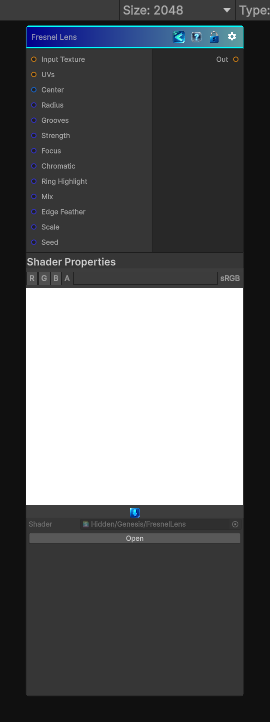

<link rel="stylesheet" href="../_assets/theme.css">

<button type="button" class="genesis-theme-toggle" data-genesis-theme-toggle aria-label="Toggle theme">Dark</button>

---
category: "Effects"
---

# Fresnel Lens

> Fresnel Lens Effect

## Description

Fresnel Lens Effect

Applies concentric Fresnel lens grooves to an input texture, adding radial refraction, chromatic splitting, focus falloff, and ring highlights.

## Inputs

| Name | Type | Description |
|------|------|-------------|

## Outputs

| Name | Type |
|------|------|

## Parameters

| Setting | Type | Default | Description |
|---------|------|---------|-------------|
| Center | Vector | (0.5,0.5,0,0) | Center of the lens |
| Radius | Range | 0.5 | Radius of the lens aperture |
| Grooves | Range | 48 | Number of concentric Fresnel grooves |
| Strength | Range | 0.18 | Refraction strength |
| Focus | Range | 1.0 | Focus power across the lens |
| Chromatic | Range | 0.18 | Chromatic channel separation |
| Ring Highlight | Range | 0.55 | Ring highlight strength |
| Mix | Range | 1.0 | Blend between original and refracted image |
| Edge Feather | Range | 0.12 | Feather at the lens edge |
| Scale | Float | 1.0 | Input UV scale |
| Seed | Int | 42 | Random seed |

## See Also

- [Back to Fresnel Lens](./effects-index.md)
