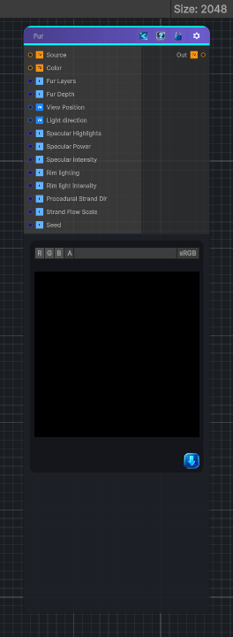

<link rel="stylesheet" href="../_assets/theme.css">

<button type="button" class="genesis-theme-toggle" data-genesis-theme-toggle aria-label="Toggle theme">Dark</button>

---
category: "Effects"
---

# Fur

> Simulates fur on a texture, color based on another texture

## Description

Simulates fur on a texture, color based on another texture

## Inputs

| Name | Type | Description |
|------|------|-------------|
| Source | Texture2D | Source Texture |
| Color | Texture2D | Color Texture |
| Fur Layers | Single | Fur layers |
| Fur Depth | Single | The depth of the fur |
| View Position | Vector4 | View position defines where the result is viewed from |
| Light direction | Vector4 | Direction light is aiming |
| Specular Highlights | Single | Use specular highlights |
| Specular Power | Single | Specular power increases the total power of the highlight |
| Specular intensity | Single | Specular intensity increases the harshness of the highlight |
| Rim lighting | Single | Enable Rim Lighting |
| Rim light intensity | Single | Rim light intensity |
| Procedural Strand Dir | Single | Use procedural strand direction |
| Strand Flow Scale | Single | Procedural strand flow scale |
| Seed | Single | Seed value |

## Outputs

| Name | Type |
|------|------|
| Out | Texture2D |

## Parameters

| Setting | Type | Default | Description |
|---------|------|---------|-------------|
| Fur Layers | Range | 30 | Fur layers |
| Fur Depth | Range | 0.5 | The depth of the fur |
| View Position | Vector | (0,0,1,0) | View position defines where the result is viewed from |
| Light direction | Vector | (0,1,1,0) | Direction light is aiming |
| Specular Highlights | Enum | 1 | Use specular highlights |
| Specular Power | Range | 32 | Specular power increases the total power of the highlight |
| Specular intensity | Range | 1 | Specular intensity increases the harshness of the highlight |
| Rim lighting | Enum | 1 | Enable Rim Lighting |
| Rim light intensity | Range | 0.25 | Rim light intensity |
| Procedural Strand Dir | Enum | 100 | Use procedural strand direction |
| Strand Flow Scale | Range | 1.0 | Procedural strand flow scale |
| Seed | int | 52 | Seed value |

## See Also

- [Back to Fur](./effects-index.md)
