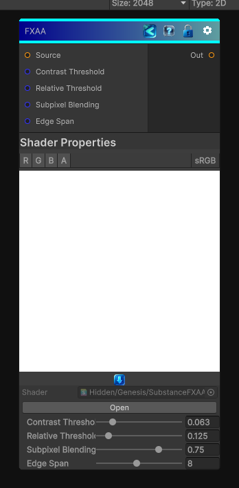

<link rel="stylesheet" href="../_assets/theme.css">

<button type="button" class="genesis-theme-toggle" data-genesis-theme-toggle aria-label="Toggle theme">Dark</button>

---
category: "Effects"
---

# FXAA

> Applies fast approximate anti-aliasing to soften jagged high-contrast texture edges, similar to Substance Designer's FXAA node.

## Description

Applies fast approximate anti-aliasing to soften jagged high-contrast texture edges, similar to Substance Designer's FXAA node.

## Inputs

| Name | Type | Description |
|------|------|-------------|

## Outputs

| Name | Type |
|------|------|

## Parameters

| Setting | Type | Default | Description |
|---------|------|---------|-------------|
| Contrast Threshold | Range | 0.063 | Controls the contrast threshold. |
| Relative Threshold | Range | 0.125 | Controls the relative threshold. |
| Subpixel Blending | Range | 0.75 | Controls the subpixel blending. |
| Edge Span | Range | 8.0 | Controls the edge span. |

## See Also

- [Back to FXAA](./effects-index.md)
