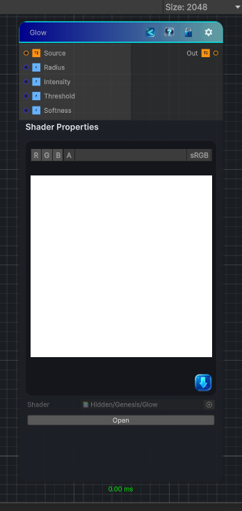

<link rel="stylesheet" href="../_assets/theme.css">

<button type="button" class="genesis-theme-toggle" data-genesis-theme-toggle aria-label="Toggle theme">Dark</button>

---
category: "Effects"
---

# Glow

> It’s a procedural halo generator that creates:

## Description

It’s a procedural halo generator that creates:
- A soft radial glow around bright areas
- With falloff shaping
- Intensity and radius control
- Thresholding so only bright pixels glow
- Fully grayscale‑friendly

## Inputs

| Name | Type | Description |
|------|------|-------------|
| Source | Texture2D |  |
| Radius | Single |  |
| Intensity | Single |  |
| Threshold | Single |  |
| Softness | Single |  |

## Outputs

| Name | Type |
|------|------|
| Out | Texture2D |

## Parameters

| Setting | Type | Default | Description |
|---------|------|---------|-------------|
| Radius | Range | 8 | Controls the radius. |
| Intensity | Range | 1 | Controls the intensity. |
| Threshold | Range | 0.5 | Controls the threshold. |
| Softness | Range | 0.5 | Controls the softness. |

## See Also

- [Back to Glow](./effects-index.md)
