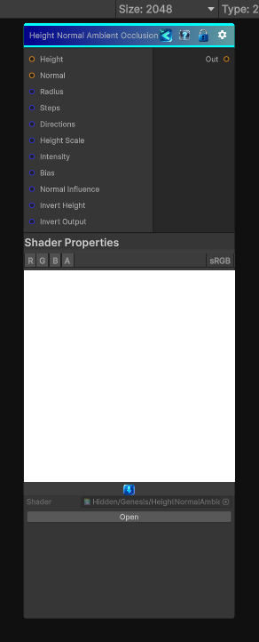

<link rel="stylesheet" href="../_assets/theme.css">

<button type="button" class="genesis-theme-toggle" data-genesis-theme-toggle aria-label="Toggle theme">Dark</button>

---
category: "Effects"
---

# Height Normal Ambient Occlusion

> Generates an ambient occlusion mask from a height map and a tangent-space normal map.

## Description

Generates an ambient occlusion mask from a height map and a tangent-space normal map.

## Inputs

| Name | Type | Description |
|------|------|-------------|
| Height | Texture2D |  |
| Normal | Texture2D |  |
| Radius | Single | Maximum sample radius in pixels |
| Steps | Single | Number of samples per direction |
| Directions | Single | Number of radial directions |
| Height Scale | Single | Scales height differences before they become occlusion |
| Intensity | Single | Overall occlusion strength |
| Bias | Single | Positive values reduce self occlusion from tiny height changes |
| Normal Influence | Single | How much the normal map biases directional occlusion |
| Invert Height | Single |  |
| Invert Output | Single |  |

## Outputs

| Name | Type |
|------|------|
| Out | Texture2D |

## Parameters

| Setting | Type | Default | Description |
|---------|------|---------|-------------|
| Radius | Range | 24 | Maximum sample radius in pixels |
| Steps | Int Range | 8 | Number of samples per direction |
| Directions | Int Range | 16 | Number of radial directions |
| Height Scale | Range | 4 | Scales height differences before they become occlusion |
| Intensity | Range | 1 | Overall occlusion strength |
| Bias | Range | 0.03 | Positive values reduce self occlusion from tiny height changes |
| Normal Influence | Range | 0.5 | How much the normal map biases directional occlusion |
| Invert Height | Toggle | 0 | Controls the invert height. |
| Invert Output | Toggle | 0 | Controls the invert output. |

## See Also

- [Back to Height Normal Ambient Occlusion](./effects-index.md)
