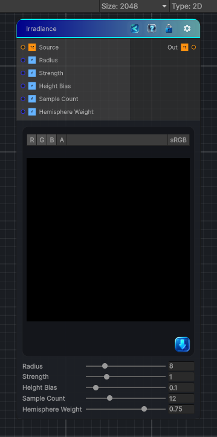

<link rel="stylesheet" href="../_assets/theme.css">

<button type="button" class="genesis-theme-toggle" data-genesis-theme-toggle aria-label="Toggle theme">Dark</button>

---
category: "Effects"
---

# Irradiance

> Essentially a real‑time hemispherical light integration node. It computes a soft, view‑independent irradiance term by:

## Description

 Essentially a real‑time hemispherical light integration node. It computes a soft, view‑independent irradiance term by:
• 	Sampling the source height/albedo
• 	Integrating light from multiple directions
• 	Using a hemisphere kernel
• 	Producing a soft ambient occlusion–like irradiance map
It’s not SSAO, not blur, not curvature — it’s a multi‑directional, weighted gather that simulates diffuse light accumulation.

## Inputs

| Name | Type | Description |
|------|------|-------------|
| Source | Texture2D |  |
| Radius | Single |  |
| Strength | Single |  |
| Height Bias | Single |  |
| Sample Count | Single |  |
| Hemisphere Weight | Single |  |

## Outputs

| Name | Type |
|------|------|
| Out | Texture2D |

## Parameters

| Setting | Type | Default | Description |
|---------|------|---------|-------------|
| Radius | Range | 8 | Controls the radius. |
| Strength | Range | 1 | Controls the strength. |
| Height Bias | Range | 0.1 | Controls the height bias. |
| Sample Count | Range | 12 | Controls the sample count. |
| Hemisphere Weight | Range | 0.75 | Controls the hemisphere weight. |

## See Also

- [Back to Irradiance](./effects-index.md)
