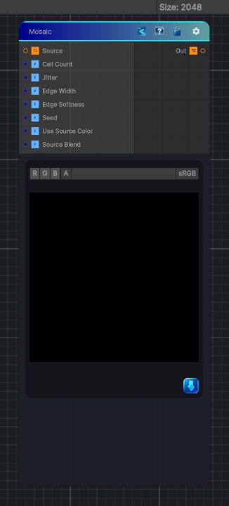

<link rel="stylesheet" href="../_assets/theme.css">

<button type="button" class="genesis-theme-toggle" data-genesis-theme-toggle aria-label="Toggle theme">Dark</button>

---
category: "Effects"
---

# Mosaic

> - Voronoi‑style cell partitioning

## Description

- Voronoi‑style cell partitioning
- Random per‑cell color
- Cell jitter / irregularity
- Edge width
- Edge softness
- Seed‑driven randomness
It’s essentially a stylized Voronoi mosaic generator.
Below is a fully Genesis CRT–compliant implementation:
- Deterministic
- Sampler‑agnostic (SAMPLE_X)
- Works for 2D / 3D / Cube
- Produces:
- Cell ID
- Random color per cell
- Edge mask
- Soft edges

## Inputs

| Name | Type | Description |
|------|------|-------------|
| Source | Texture2D |  |
| Cell Count | Single |  |
| Jitter | Single |  |
| Edge Width | Single |  |
| Edge Softness | Single |  |
| Seed | Single |  |
| Use Source Color | Single |  |
| Source Blend | Single |  |

## Outputs

| Name | Type |
|------|------|
| Out | Texture2D |

## Parameters

| Setting | Type | Default | Description |
|---------|------|---------|-------------|
| Cell Count | Range | 32 | Controls the cell count. |
| Jitter | Range | 0.5 | Controls the jitter. |
| Edge Width | Range | 0.05 | Controls the edge width. |
| Edge Softness | Range | 0.25 | Controls the edge softness. |
| Seed | Range | 0 | Controls the seed. |
| Use Source Color | Range | 1 | Controls the use source color. |
| Source Blend | Range | 1 | Controls the source blend. |

## See Also

- [Back to Mosaic](./effects-index.md)
