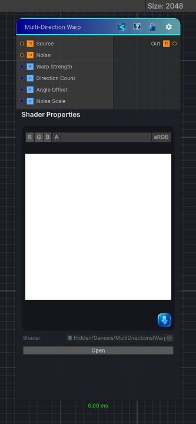

<link rel="stylesheet" href="../_assets/theme.css">

<button type="button" class="genesis-theme-toggle" data-genesis-theme-toggle aria-label="Toggle theme">Dark</button>

---
category: "Effects"
---

# Multi-Direction Warp

> - Samples the source multiple times along several directions

## Description

- Samples the source multiple times along several directions
- Each direction is modulated by a noise map
- The offsets are blended together
- Produces a soft, organic, multi‑axis distortion
- Unlike Directional Warp, it’s not linear — it’s multi‑vector
So the Genesis CRT version needs:
- ✔ Multiple warp directions
- ✔ Per‑direction noise sampling
- ✔ Strength control
- ✔ Blend mode (average)
- ✔ Works for 2D / 3D / Cube
- ✔ Deterministic, sampler‑free, CRT‑ready

## Inputs

| Name | Type | Description |
|------|------|-------------|
| Source | Texture2D |  |
| Noise | Texture2D |  |
| Warp Strength | Single |  |
| Direction Count | Single |  |
| Angle Offset | Single |  |
| Noise Scale | Single |  |

## Outputs

| Name | Type |
|------|------|
| Out | Texture2D |

## Parameters

| Setting | Type | Default | Description |
|---------|------|---------|-------------|
| Warp Strength | Range | 10 | Controls the warp strength. |
| Direction Count | Range | 4 | Controls the direction count. |
| Angle Offset | Range | 0 | Controls the angle offset. |
| Noise Scale | Range | 1 | Controls the noise scale. |

## See Also

- [Back to Multi-Direction Warp](./effects-index.md)
