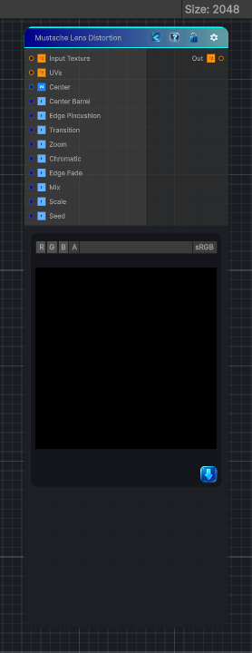

<link rel="stylesheet" href="../_assets/theme.css">

<button type="button" class="genesis-theme-toggle" data-genesis-theme-toggle aria-label="Toggle theme">Dark</button>

---
category: "Effects"
---

# Mustache Lens Distortion

> Mustache Lens Distortion Effect

## Description

Mustache Lens Distortion Effect

Applies compound radial lens distortion with barrel pull near the center and pincushion correction toward the edges.

## Inputs

| Name | Type | Description |
|------|------|-------------|
| Input Texture | Texture2D |  |
| UVs | Texture2D |  |
| Center | Vector4 | Center of the lens |
| Center Barrel | Single | Outward barrel bend near the center |
| Edge Pincushion | Single | Inward pincushion correction near the edges |
| Transition | Single | Radius where barrel transitions into pincushion |
| Zoom | Single | Zoom compensation after distortion |
| Chromatic | Single | Chromatic channel separation |
| Edge Fade | Single | Edge fade for stretched borders |
| Mix | Single | Blend between original and distorted image |
| Scale | Single | Input UV scale |
| Seed | Single | Random seed |

## Outputs

| Name | Type |
|------|------|
| Out | Texture2D |

## Parameters

| Setting | Type | Default | Description |
|---------|------|---------|-------------|
| Center | Vector | (0.5,0.5,0,0) | Center of the lens |
| Center Barrel | Range | 0.36 | Outward barrel bend near the center |
| Edge Pincushion | Range | 0.34 | Inward pincushion correction near the edges |
| Transition | Range | 0.58 | Radius where barrel transitions into pincushion |
| Zoom | Range | 1.0 | Zoom compensation after distortion |
| Chromatic | Range | 0.14 | Chromatic channel separation |
| Edge Fade | Range | 0.22 | Edge fade for stretched borders |
| Mix | Range | 1.0 | Blend between original and distorted image |
| Scale | Float | 1.0 | Input UV scale |
| Seed | Int | 42 | Random seed |

## See Also

- [Back to Mustache Lens Distortion](./effects-index.md)
