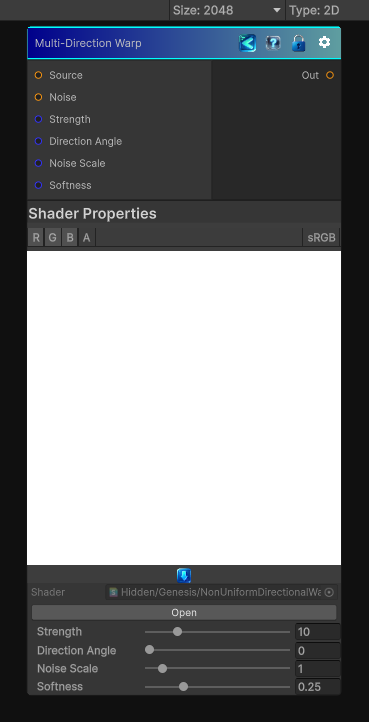

<link rel="stylesheet" href="../_assets/theme.css">

<button type="button" class="genesis-theme-toggle" data-genesis-theme-toggle aria-label="Toggle theme">Dark</button>

---
category: "Effects"
---

# Non-Uniform Directional Warp

> - Takes a source image

## Description

- Takes a source image
- Takes a noise/intensity map
- Takes a direction angle
- Computes a per‑pixel warp offset = direction × noise × strength
- Samples the source at that offset
- Optionally applies softness (Substance’s “Intensity” curve)
It’s basically:
UV' = UV + dir * noise * strength
But with:
- ✔ Direction angle
- ✔ Noise scale
- ✔ Strength
- ✔ Softness shaping
- ✔ Works on grayscale or color

## Inputs

| Name | Type | Description |
|------|------|-------------|

## Outputs

| Name | Type |
|------|------|

## Parameters

| Setting | Type | Default | Description |
|---------|------|---------|-------------|
| Strength | Range | 10 | Controls the strength. |
| Direction Angle | Range | 0 | Controls the direction angle. |
| Noise Scale | Range | 1 | Controls the noise scale. |
| Softness | Range | 0.25 | Controls the softness. |

## See Also

- [Back to Non-Uniform Directional Warp](./effects-index.md)
