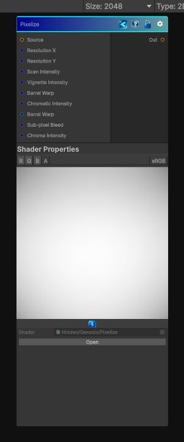

<link rel="stylesheet" href="../_assets/theme.css">

<button type="button" class="genesis-theme-toggle" data-genesis-theme-toggle aria-label="Toggle theme">Dark</button>

---
category: "Effects"
---

# Pixelize

> Pixelization node with scan line support

## Description

Pixelization node with scan line support

## Inputs

| Name | Type | Description |
|------|------|-------------|

## Outputs

| Name | Type |
|------|------|

## Parameters

| Setting | Type | Default | Description |
|---------|------|---------|-------------|
| Resolution X | Range | 320 | Simulated resolution width |
| Resolution Y | Range | 240 | Simulated resolution height |
| Scan Intensity | Range | 0.25 | Scan line intensity |
| Vignette Intensity | Range | 0.25 | Vignette intensity |
| Barrel Warp | Enum | 1 | Use barrel warping |
| Chromatic Intensity | Enum | 1 | Use chromatic intesity |
| Barrel Warp | Vector2 | (0.2,0.1,0.0) | Barrel warping intensity |
| Sub-pixel Bleed | Enum | 1 | Use subpixel bleeding effect |
| Chroma Intensity | Range | 2. | Chroma intesity |

## See Also

- [Back to Pixelize](./effects-index.md)
