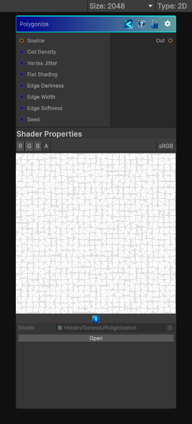

<link rel="stylesheet" href="../_assets/theme.css">

<button type="button" class="genesis-theme-toggle" data-genesis-theme-toggle aria-label="Toggle theme">Dark</button>

---
category: "Effects"
---

# Poliginize

> Applies a low-poly polygonization effect by triangulating the source image into jittered cells and simplifying the color inside each triangle.

## Description

Applies a low-poly polygonization effect by triangulating the source image into jittered cells and simplifying the color inside each triangle.

## Inputs

| Name | Type | Description |
|------|------|-------------|

## Outputs

| Name | Type |
|------|------|

## Parameters

| Setting | Type | Default | Description |
|---------|------|---------|-------------|
| Cell Density | Range | 28 | Number of cells used to triangulate the source image |
| Vertex Jitter | Range | 0.7 | Random offset applied to each triangle vertex |
| Flat Shading | Range | 1 | Blends between barycentric vertex colors and a flat triangle color |
| Edge Darkness | Range | 0.25 | Darkens the seams between triangles |
| Edge Width | Range | 0.05 | Thickness of the triangle seams |
| Edge Softness | Range | 0.02 | Softens the triangle seam transition |
| Seed | Range | 0 | Seed used for the vertex jitter pattern |

## See Also

- [Back to Poliginize](./effects-index.md)
