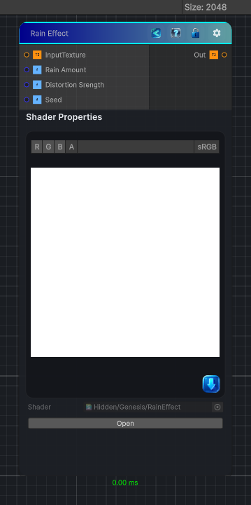

<link rel="stylesheet" href="../_assets/theme.css">

<button type="button" class="genesis-theme-toggle" data-genesis-theme-toggle aria-label="Toggle theme">Dark</button>

---
category: "Effects"
---

# Rain

> Effect that simulates rain on the 'Camera'

## Description

Effect that simulates rain on the 'Camera'

## Inputs

| Name | Type | Description |
|------|------|-------------|
| InputTexture | Texture2D |  |
| Rain Amount | Single | Defines the amount of rain on the screen |
| Distortion Srength | Single | Amount of blurring of the screen, makes the rain drops more pronounced |
| Seed | Single | Seed value |

## Outputs

| Name | Type |
|------|------|
| Out | Texture2D |

## Parameters

| Setting | Type | Default | Description |
|---------|------|---------|-------------|
| Rain Amount | Range | 0.3 | Defines the amount of rain on the screen |
| Distortion Srength | Range | 0.02 | Amount of blurring of the screen, makes the rain drops more pronounced |
| Seed | float | 52.0 | Seed value |

## See Also

- [Back to Rain](./effects-index.md)
