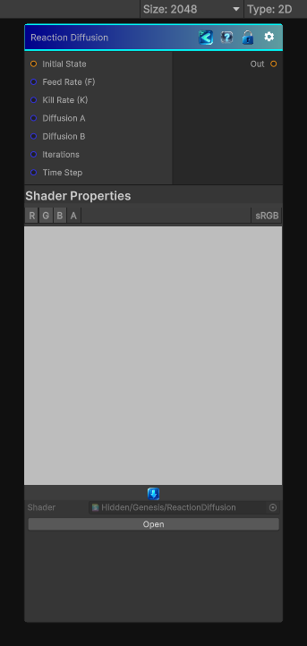

<link rel="stylesheet" href="../_assets/theme.css">

<button type="button" class="genesis-theme-toggle" data-genesis-theme-toggle aria-label="Toggle theme">Dark</button>

---
category: "Effects"
---

# Reaction Diffusion

> discrete reaction‑diffusion solver:

## Description

 discrete reaction‑diffusion solver:
- Two fields: A (activator) and B (inhibitor)
- A diffuses slowly, B diffuses faster
- They react according to the Gray‑Scott equations
- After a number of iterations, you get:
- Spots
- Stripes
- Labyrinths
- Turing patterns

## Inputs

| Name | Type | Description |
|------|------|-------------|

## Outputs

| Name | Type |
|------|------|

## Parameters

| Setting | Type | Default | Description |
|---------|------|---------|-------------|
| Feed Rate (F) | Range | 0.055 | Controls the feed rate (f). |
| Kill Rate (K) | Range | 0.062 | Controls the kill rate (k). |
| Diffusion A | Range | 0.2 | Controls the diffusion a. |
| Diffusion B | Range | 0.1 | Controls the diffusion b. |
| Iterations | Range | 16 | Controls the iterations. |
| Time Step | Range | 1.0 | Controls the time step. |

## See Also

- [Back to Reaction Diffusion](./effects-index.md)
