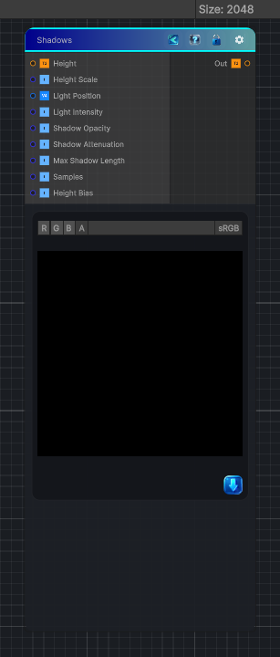

<link rel="stylesheet" href="../_assets/theme.css">

<button type="button" class="genesis-theme-toggle" data-genesis-theme-toggle aria-label="Toggle theme">Dark</button>

---
category: "Effects"
---

# Shadows

> Creates ray‑traced shadows from a height map, with light position, samples, max length, attenuation, opacity, and height scale.

## Description

Creates ray‑traced shadows from a height map, with light position, samples, max length, attenuation, opacity, and height scale.

## Inputs

| Name | Type | Description |
|------|------|-------------|
| Height | Texture2D |  |
| Height Scale | Single |  |
| Light Position | Vector4 |  |
| Light Intensity | Single |  |
| Shadow Opacity | Single |  |
| Shadow Attenuation | Single |  |
| Max Shadow Length | Single |  |
| Samples | Single |  |
| Height Bias | Single |  |

## Outputs

| Name | Type |
|------|------|
| Out | Texture2D |

## Parameters

| Setting | Type | Default | Description |
|---------|------|---------|-------------|
| Height Scale | Range | 1.0 | Controls the height scale. |
| Light Position | Vector | (0.0, 0.5, 0, 0) | Controls the light position. |
| Light Intensity | Range | 1.0 | Controls the light intensity. |
| Shadow Opacity | Range | 1.0 | Controls the shadow opacity. |
| Shadow Attenuation | Range | 1.0 | Controls the shadow attenuation. |
| Max Shadow Length | Range | 32.0 | Controls the max shadow length. |
| Samples | Range | 24 | Controls the samples. |
| Height Bias | Range | 0.01 | Controls the height bias. |

## See Also

- [Back to Shadows](./effects-index.md)
