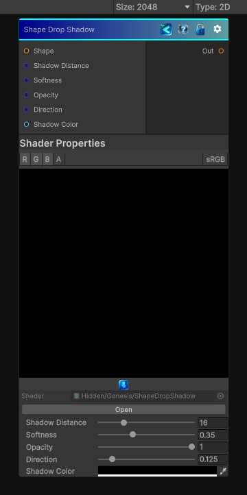

<link rel="stylesheet" href="../_assets/theme.css">

<button type="button" class="genesis-theme-toggle" data-genesis-theme-toggle aria-label="Toggle theme">Dark</button>

---
category: "Effects"
---

# Shape Drop Shadow

> Shape Drop Shadow — the one that takes a shape mask and produces a soft, directional, distance‑based shadow with:

## Description

Shape Drop Shadow — the one that takes a shape mask and produces a soft, directional, distance‑based shadow with:
- Direction
- Distance
- Softness
- Opacity
- Color
- Height‑aware falloff (optional in Substance)
This is not a blur, not a bevel — it’s a ray‑marched shadow cast from a binary shape

## Inputs

| Name | Type | Description |
|------|------|-------------|

## Outputs

| Name | Type |
|------|------|

## Parameters

| Setting | Type | Default | Description |
|---------|------|---------|-------------|
| Shadow Distance | Range | 16 | Controls the shadow distance. |
| Softness | Range | 0.35 | Controls the softness. |
| Opacity | Range | 1.0 | Controls the opacity. |
| Direction | Range | 0.125 | Controls the direction. |
| Shadow Color | Color | (0,0,0,1) | Controls the shadow color. |

## See Also

- [Back to Shape Drop Shadow](./effects-index.md)
