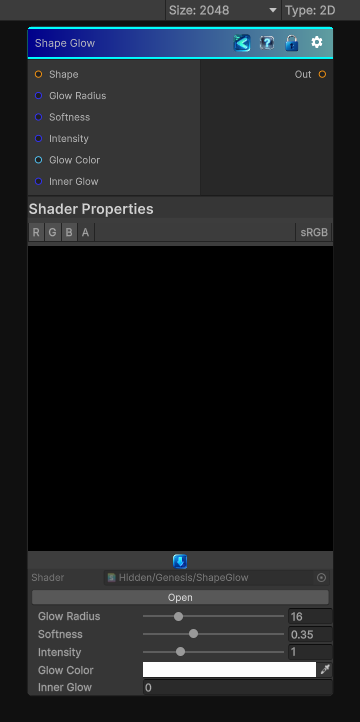

<link rel="stylesheet" href="../_assets/theme.css">

<button type="button" class="genesis-theme-toggle" data-genesis-theme-toggle aria-label="Toggle theme">Dark</button>

---
category: "Effects"
---

# Shape Glow

> Essentially the sibling of Shape Drop Shadow, but instead of casting a directional shadow, it creates a soft, radial, emissive halo around a binary shape.

## Description

Essentially the sibling of Shape Drop Shadow, but instead of casting a directional shadow, it creates a soft, radial, emissive halo around a binary shape.
It’s not bloom, not blur, not bevel — it’s a distance‑based glow with:
- Glow radius
- Softness
- Intensity
- Color
- Optional inner glow
- Fully shape‑aware

## Inputs

| Name | Type | Description |
|------|------|-------------|

## Outputs

| Name | Type |
|------|------|

## Parameters

| Setting | Type | Default | Description |
|---------|------|---------|-------------|
| Glow Radius | Range | 16 | Controls the glow radius. |
| Softness | Range | 0.35 | Controls the softness. |
| Intensity | Range | 1.0 | Controls the intensity. |
| Glow Color | Color | (1,1,1,1) | Controls the glow color. |
| Inner Glow | Int | 0 | Controls the inner glow. |

## See Also

- [Back to Shape Glow](./effects-index.md)
